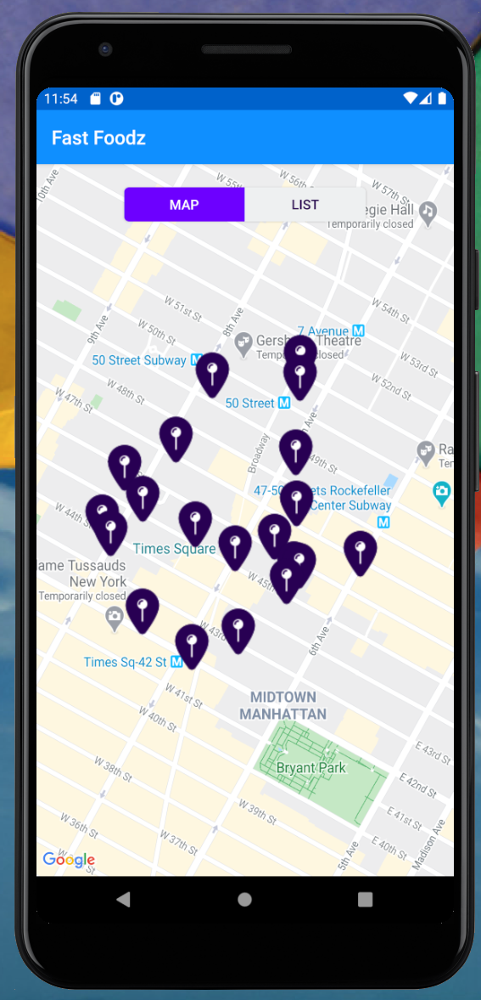
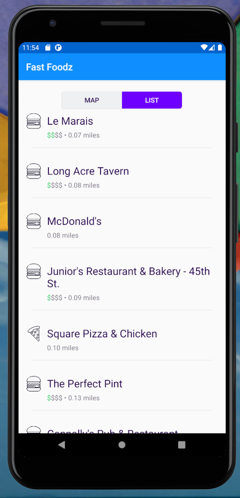
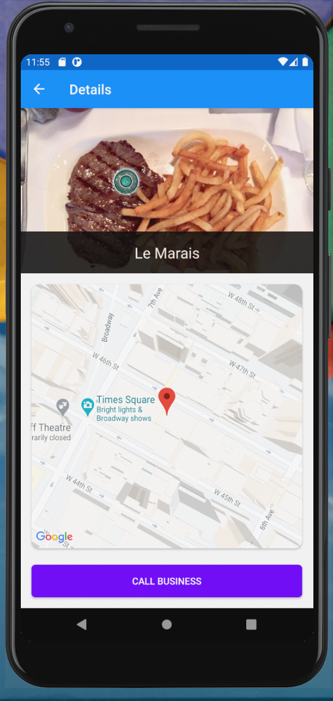

# Fast Foodz Android

A fun little app that queries Yelp's search api and displays it in various views.

A List of Notables:
* Duplicates iOS's Segmented Control using CardView and ViewPager
* Uses Android Jetpack - ViewModel, Navigation, LiveData and LifeCycle
* Google Maps - The hardest part was hooking hooking up MapView properly and generating the API Key.
* GraphQL - [Yelp's GraphQL Introduction](https://www.yelp.com/developers/graphql/guides/intro)
* Apollo - The Apollo github page had a very ambigous statement on where to put the graphql files. Once I figured it out, it was a pleasure to use. Prior to that it was epic level of frustration.

